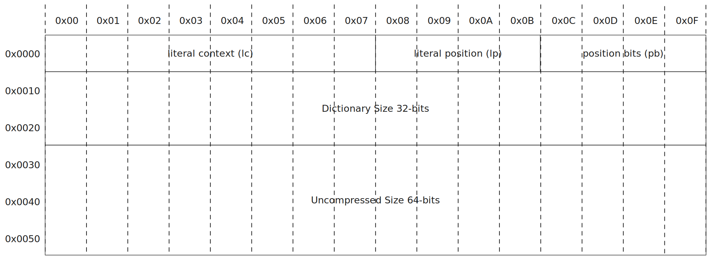

# lzma1

This is a [fork][fork-link] of [Nathan Rugg's][fork-author] package that adds
types and makes the logic more structured and readable.

[fork-link]: https://github.com/LZMA-JS/LZMA-JS
[fork-author]: https://github.com/nmrugg

## Installation

> [!NOTE]
> This package is native [ESM][mozzila-esm] and no longer provides a
> CommonJS export. If your project uses CommonJS, you will have to convert to ESM
> or use the dynamic [`import()`][mozzila-import] function.

[mozzila-esm]: https://developer.mozilla.org/en-US/docs/Web/JavaScript/Guide/Modules
[mozzila-import]: https://developer.mozilla.org/en-US/docs/Web/JavaScript/Reference/Operators/import

### npm

```sh
npm install lzma1
```

### deno

Since `v1.28+` import from npm registry using `npm:` prefix.

```ts
import {
	compress,
	decompress,
} from "npm:lzma1@latest";
```

### browser

```html
<script type="module">
	import { compress, decompress } from "https://esm.sh/lzma1@latest";
</script>
```

## API

```ts
compress(data: string | Uint8Array, mode?: Mode): Int8Array
decompress(data: Uint8Array | ArrayBuffer): string | Int8Array
```

## Usage

Compress and decompress a string with compression level 1.

```js
import {
	compress,
	decompress,
} from "lzma1";

const data = "Hello World!";
const compressed = compress(data, 1);
const decompressed = decompress(result);

// data === decompressed
```

## LZMA header

More [information][header_link] about the LZMA header.



## Related

- <https://github.com/cscott/lzma-purejs>
- <https://github.com/glinscott/lzmajs>
- <https://github.com/mauron85/lzma-purejs/tree/master>

[header_link]: https://docs.fileformat.com/compression/lzma/#lzma-header
