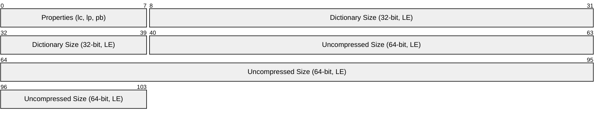

<div align="center">

<h1>lzma1</h1>

A TypeScript implementation of the Lempel-Ziv-Markov chain algorithm (LZMA)
for the `.lzma` format, ported from [XZ for Java][xz-java]. It started as a
[fork][fork-link] of [Nathan Rugg's][fork-author] LZMA-JS package.

</div>

[xz-java]: https://github.com/tukaani-project/xz-java
[fork-link]: https://github.com/LZMA-JS/LZMA-JS
[fork-author]: https://github.com/nmrugg

## Why

There are many LZMA implementations in JavaScript, but most are outdated,
unmaintained, lack type support, or rely on specific runtime APIs (e.g.,
Node.js `Buffer`).

This version is a port of XZ for Java, a clean implementation of LZMA by Lasse
Collin and Igor Pavlov, with some optimizations from the LZMA SDK. It is
compatible with `xz --format=lzma`, 7-Zip and the LZMA SDK, and uses only web
standard APIs.

## Features

- Encode and decode `.lzma` data, interoperable with `xz`, 7-Zip and LZMA SDK
- Strings (UTF-8) and binary data (`ArrayBuffer` or any typed array)
- Compression levels 1-9 or fine-grained options (dictionary size,
  `lc`/`lp`/`pb`, ...)
- Web Streams (`TransformStream`) for compressing and decompressing streams
- Errors on truncated input and on most corrupted input
- No dependencies, runs in browsers, workers, Node.js, Deno and Bun

## Installation

> [!NOTE]
> This package is native [ESM][mozzila-esm] and no longer provides a CommonJS
> export. If your project uses CommonJS, you will have to convert to ESM or use
> the dynamic [`import()`][mozzila-import] function.

[mozzila-esm]: https://developer.mozilla.org/en-US/docs/Web/JavaScript/Guide/Modules
[mozzila-import]: https://developer.mozilla.org/en-US/docs/Web/JavaScript/Reference/Operators/import

### [npm](https://npmjs.com/lzma1)

```sh
npm install lzma1
```

### browser

```html
<script type="module">
	import {
		compress,
		compressString,
		decompress,
		decompressString,
	} from "https://esm.sh/lzma1@latest";
</script>
```

## Quick start

The library provides four main functions for compression and decompression:

```ts
// For binary data
compress(data: ArrayBuffer | ArrayBufferView, mode?: 1-9 | CompressionOptions): Uint8Array
decompress(data: ArrayBuffer | ArrayBufferView): Uint8Array

// For string data
compressString(data: string, mode?: 1-9 | CompressionOptions): Uint8Array
decompressString(data: ArrayBuffer | ArrayBufferView): string
```

Strings are encoded as UTF-8. `decompressString` also decodes data compressed
by v0.3.0 and older, which used Java's "modified UTF-8". The `LZMA` class
from v0.2.0 is exported again; its `decompress` now returns a `Uint8Array`.

### Compressing a string

```js
import {
	compressString,
	decompressString,
} from "lzma1";

const data = "Hello World!";
const compressed = compressString(data, 1); // level 1 (fastest)
const decompressed = decompressString(compressed);

// data === decompressed
```

### Working with binary data

```js
import {
	compress,
	decompress,
} from "lzma1";

const binaryData = new Uint8Array([0x01, 0x02, 0x03, 0x04]);
const compressed = compress(binaryData, 5); // default level
const decompressed = decompress(compressed);
```

### Compression options

The level (1-9, default 5) trades speed for size:

| Level | Encoder | Match finder | Dictionary |
| ----- | ------- | ------------ | ---------- |
| 1     | fast    | hc4          | 1 MiB      |
| 2     | fast    | hc4          | 2 MiB      |
| 3     | fast    | hc4          | 4 MiB      |
| 4     | normal  | bt4          | 1 MiB      |
| 5     | normal  | bt4          | 2 MiB      |
| 6     | normal  | bt4          | 4 MiB      |
| 7     | normal  | bt4          | 8 MiB      |
| 8     | normal  | bt4          | 16 MiB     |
| 9     | normal  | bt4          | 32 MiB     |

Instead of a level, pass options. Options not given come from the level.

```js
const compressed = compress(data, {
	level: 9, // preset 1-9
	dictSize: 1 << 20, // dictionary size in bytes, 4 KiB - 768 MiB
	lc: 3, // literal context bits, 0-4
	lp: 0, // literal position bits, 0-4, lc + lp <= 4
	pb: 2, // position bits, 0-4
	mode: "normal", // "fast" or "normal" (optimal parsing)
	niceLen: 64, // match length that is good enough, 8-273
	matchFinder: "bt4", // "hc4" (hash chain) or "bt4" (binary tree)
	depth: 0, // match finder search depth, 0 = automatic
});
```

A dictionary larger than the input is reduced to fit it, which saves memory
when compressing and decompressing. Data with `lc + lp > 4` from other
encoders (e.g. 7-Zip) can still be decompressed.

### Streams

`Compress` and `Decompress` are `TransformStream`s, used like the built-in
`CompressionStream`:

```js
import {
	Compress,
	Decompress,
} from "lzma1";

// Compress a file
const compressed = file.stream().pipeThrough(new Compress(5));

// Decompress a download
const response = await fetch("/data.lzma");
const text = await new Response(response.body.pipeThrough(new Decompress())).text();
```

A stream's size isn't known in advance, so the header marks it as unknown and
the data ends with an end marker.

### Errors

Decompressing truncated or corrupted data throws an `Error`, e.g.
`"Truncated input"` or `"Corrupted input: match distance is too large"`.
The `.lzma` format has no checksum, so some corrupted data decodes without
an error to different output.
Invalid options throw a `RangeError`.

### HTML example

```html
<!DOCTYPE html>
<html>
	<body>
		<textarea id="input">Hello World!</textarea><br />
		<button id="run">Compress & Decompress</button>
		<div id="result"></div>

		<script type="module">
			import { compressString, decompressString } from "https://esm.sh/lzma1@latest";

			document.getElementById("run").onclick = () => {
				const text = document.getElementById("input").value;
				const compressed = compressString(text);
				const decompressed = decompressString(compressed);

				document.getElementById("result").innerHTML =
					`Original: ${text.length} bytes<br>` +
					`Compressed: ${compressed.length} bytes<br>` +
					`Result: ${decompressed}`;
			};
		</script>
	</body>
</html>
```

## How it works

LZMA (Lempel-Ziv-Markov chain Algorithm) is a compression algorithm that
combines a dictionary (LZ77-style) compressor with a range coder. It's known
for its high compression ratio and is used in the 7z and xz formats.

### LZMA header

The `.lzma` data starts with a 13-byte header, followed by the compressed data:


```mermaid
packet-beta
  0-7: "Properties (lc, lp, pb)"
  8-39: "Dictionary Size (32-bit, LE)"
  40-103: "Uncompressed Size (64-bit, LE)"
```

The first byte is `(pb * 5 + lp) * 9 + lc`. An uncompressed size of all `0xFF`
bytes means unknown. More [information][header_link] about the LZMA header
structure.

[header_link]: https://docs.fileformat.com/compression/lzma/#lzma-header

### Benchmarks

See [docs/benchmarks.md](docs/benchmarks.md), and [bench](bench) to run them.

## Related

- [XZ for Java](https://github.com/tukaani-project/xz-java) - the implementation this library is ported from
- [LZMA SDK](https://www.7-zip.org/sdk.html) - the reference implementation by Igor Pavlov
- [XZ Utils](https://github.com/tukaani-project/xz) - `xz` and liblzma
- [LZMA-JS](https://github.com/LZMA-JS/LZMA-JS) - the original JavaScript implementation
- [lzma-purejs](https://github.com/cscott/lzma-purejs)
- [lzmajs](https://github.com/glinscott/lzmajs)
